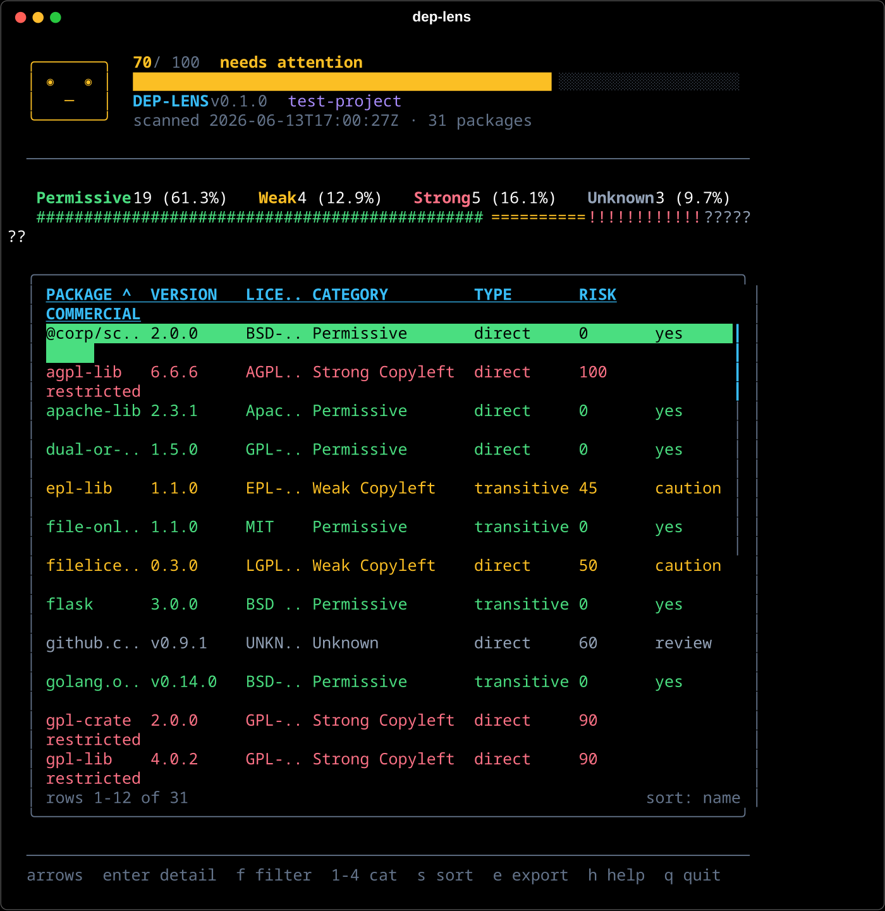

# dep-lens

Scan your project's third-party dependencies across **9 ecosystems**, classify
every license (permissive / weak copyleft / strong copyleft / unknown),
score commercial-use risk, and browse the results in a fast, colorful
terminal UI. Rust core for scanning, Node.js wrapper for a fully interactive
[Ink](https://github.com/vadimdemedes/ink)-based TUI.



## Supported ecosystems

| Ecosystem | Manifest / lockfile | License source |
| --- | --- | --- |
| npm / yarn / pnpm | `package.json` + `node_modules` | `package.json` `license` field, falls back to LICENSE file |
| Cargo | `Cargo.toml` (via `cargo metadata`) | crate metadata, falls back to LICENSE file |
| Go | `go.mod` | LICENSE file in the module cache (`$GOPATH/pkg/mod`) |
| Python | `poetry.lock`, `uv.lock`, `Pipfile.lock`, `requirements.txt`, or `pyproject.toml` | `*.dist-info/METADATA` in `.venv`/`venv` |
| Ruby | `Gemfile.lock` | gemspec `license`, falls back to vendored LICENSE file |
| PHP | `composer.lock` | `composer.json`/`composer.lock` `license` field |
| Java | `pom.xml`, `gradle.lockfile`, or `build.gradle`/`.kts` | cached POM in `~/.m2/repository` |
| Dart / Flutter | `pubspec.lock` | LICENSE file in `~/.pub-cache/hosted/pub.dev` |
| C/C++ | `vcpkg.json`, `conanfile.txt` | `vcpkg.json` fields, falls back to `vcpkg_installed/*/share/<port>/copyright`; Conan's `conanfile.txt` lists `[requires]` packages but carries no license metadata, so those report as `Unknown` |

When a package declares no usable license, dep-lens falls back to scanning
its LICENSE/COPYING file and recognizes MIT, Apache, the GPL family, BSD,
ISC, MPL, EPL, BSL, Unlicense, and CC0 from the text itself.

Python and Java work even **without a lockfile**: with only a `pyproject.toml`
(PEP 621 `dependencies` or Poetry's `[tool.poetry.dependencies]`), dep-lens
lists every declared package with its version specifier; with only a
`build.gradle`/`build.gradle.kts` (no `gradle.lockfile`), it parses
`group:artifact:version` coordinates straight out of `implementation(...)` /
`testImplementation(...)` calls.

## Install

```sh
npm install -g @lunanoir/dep-lens
```

The package ships prebuilt native binaries for Linux x64, macOS x64/arm64, and
Windows x64 via optional dependencies; the right one is selected automatically.

### From source (one command)

Linux, macOS, or WSL/Git-Bash:

```sh
git clone https://github.com/lunanoir21/dep-lens && cd dep-lens
./install.sh
```

The installer detects your operating system and login shell (fish, zsh, or
bash), checks that Node.js >= 18.18 and Rust are available, builds both
halves, installs a launcher to `~/.local/bin/dep-lens`, and adds that
directory to your PATH if it is not there yet (via `fish_add_path` on fish,
or a guarded line in `.zshrc` / `.bashrc`). Re-run it any time to rebuild;
`./install.sh --uninstall` removes the launcher.

Native Windows (PowerShell):

```powershell
git clone https://github.com/lunanoir21/dep-lens; cd dep-lens
.\install.ps1
```

Same checks and build steps, but installs `dep-lens.cmd` to
`%LOCALAPPDATA%\dep-lens\bin` and adds it to your user `PATH`.
`.\install.ps1 -Uninstall` removes it.

dep-lens itself is cross-platform: the Rust core and Node CLI build and run
on Linux, macOS, and Windows, and the prebuilt npm packages cover all three
(`dep-lens-linux-x64`, `dep-lens-darwin-x64`/`-arm64`, `dep-lens-win32-x64`).

## Usage

```sh
# Interactive TUI for the current directory
dep-lens

# Turkish UI (Turkce arayuz)
dep-lens --tr

# Scan another project
dep-lens --path ../my-app

# Raw JSON to stdout (also the default when stdout is not a TTY)
dep-lens --json

# Standalone HTML report
dep-lens --html report.html

# Exclude vetted packages
dep-lens --ignore left-pad --ignore internal-pkg-a,internal-pkg-b

# CI/CD gate: exit code 1 when strong copyleft licenses are present
dep-lens --fail-on gpl     # GPL-2.0, GPL-3.0, AGPL-3.0
dep-lens --fail-on agpl    # AGPL-3.0 only

# Self-check: verify the scanner binary and which ecosystems it detects here
dep-lens --test

# Re-run the interactive setup wizard (language, PATH check)
dep-lens --setup
```

### Setup wizard, `--setup`, and `--test`

The first time you run `dep-lens` (any form - TUI, `--json`, `--test`, ...),
it runs a short setup wizard once: it lists the ecosystems it detects in your
project, lets you pick a default UI language (saved to
`~/.config/dep-lens/config.json`), and offers to add the npm global bin
directory to your shell's `PATH` if it's missing. This happens on first use
rather than during `npm install` so it gets a real terminal to ask questions
in - run it again any time with `dep-lens --setup`.

`dep-lens --test` is a separate, repeatable self-check: it confirms the native
binary runs, performs a scan, and reports per-ecosystem whether manifests it
found actually produced packages - useful for verifying an install or a CI
environment.

```
dep-lens --test (/path/to/project)

  PASS  native scanner binary  dep-lens-core 0.1.0
  PASS  scan                   31 package(s) found
  PASS  npm / yarn / pnpm      19 package(s)
  PASS  Cargo                  3 package(s)
  PASS  license coverage       3 package(s) with unknown license

all checks passed
```

### TUI keys

| Key           | Action                                                  |
| ------------- | ------------------------------------------------------- |
| up / down     | Move selection (pgup/pgdn jump 10, g/G top/bottom)      |
| enter         | Package detail pane (license source, advice)            |
| f             | Free-text filter by package name, license, or category  |
| 1 / 2 / 3 / 4 | Quick filter: Permissive / Weak / Strong / Unknown      |
| 0             | Clear all filters                                       |
| s             | Cycle sort column                                       |
| r             | Reverse sort direction                                  |
| e             | Export menu (JSON or HTML file)                         |
| h             | Help overlay                                            |
| q             | Quit                                                    |

The header shows an overall health score (0-100) with a "doctor face" that
reacts to it, plus a score bar. Rows are colored by category - emerald for
permissive, amber for weak copyleft, rose for strong copyleft, and slate for
unknown - and the same palette drives the summary bar, ratio bar, and
scrollbar.

The TUI is fully localized; `--tr` switches every label, advice text, and
status message to Turkish. While scanning, an animated progress screen shows
the same face with an ASCII spinner and elapsed time; once results land, the
summary counters count up with an ease-out curve, the ratio bar (`#`
permissive, `=` weak, `!` strong, `?` unknown) grows to its final
proportions, and table rows reveal progressively. Status messages clear
themselves after a few seconds. All animation is plain ASCII and truecolor
ANSI; no emoji anywhere.

### CI example

```yaml
- name: License gate
  run: npx dep-lens --json --fail-on gpl
```

## License classification

| Category        | Licenses                                                                                     | Risk score                       | Commercial use |
| --------------- | -------------------------------------------------------------------------------------------- | -------------------------------- | -------------- |
| Permissive      | MIT, Apache-2.0, BSD-2/3-Clause, ISC, 0BSD, Unlicense, CC0, Zlib, BSL-1.0, Artistic-2.0, ... | 0                                | yes            |
| Weak Copyleft   | LGPL-2.0/2.1/3.0, MPL-1.1/2.0, EPL-1.0/2.0, CDDL-1.0/1.1                                      | MPL 40, EPL 45, LGPL 50, CDDL 55 | caution        |
| Strong Copyleft | GPL-1.0/2.0/3.0, AGPL-1.0/3.0, SSPL-1.0, EUPL-1.1/1.2, OSL-3.0                                | 90 (AGPL/SSPL 100)               | restricted     |
| Unknown         | Anything else or missing                                                                      | 60                               | review         |

SPDX expressions are folded: `MIT OR Apache-2.0` counts as the least
restrictive option (dual licensing lets you choose), `MIT AND GPL-2.0` as the
most restrictive. `-only` / `-or-later` suffixes and `WITH` exception clauses
are normalized away.

The JSON report records where each license came from in the `licenseSource`
field (`declared`, `licenseFile`, or `none`).

This tool produces an automated report to support a review. It is not legal
advice.

## How it works

- `crates/dep-lens-core` (Rust) scans `node_modules`, runs
  `cargo metadata --format-version 1`, and parses the lockfiles/manifests of
  the other seven ecosystems above, classifies licenses, scores risk, and
  prints a JSON (or HTML) report to stdout.
- `packages/dep-lens` (TypeScript) spawns that binary, parses the JSON, and
  renders the interactive TUI with [Ink](https://github.com/vadimdemedes/ink).

## Development

Requirements: Rust stable, Node.js >= 18.18.

```sh
npm install            # workspace deps (platform binary packages are skipped)
npm run build          # cargo build --release + tsc
npm test               # cargo test + node --test
npm run lint           # clippy -D warnings + rustfmt check

# Run the CLI from the working tree (uses target/release automatically)
node packages/dep-lens/dist/cli.js --path .
```

### Fixtures

- `test-project/` is a combined fixture covering every license scenario
  (declared, LICENSE-file-only, `SEE LICENSE IN` placeholders, SPDX
  expressions, scoped and nested npm packages, Cargo path dependencies) across
  npm, Cargo, Go, Python, Ruby, and PHP. `scripts/verify-fixture.py` scans it
  and asserts the exact classification of every package plus the `--fail-on`,
  `--ignore`, and `--html` behavior:

  ```sh
  python3 scripts/verify-fixture.py
  ```

- `examples/` has one minimal, self-contained fixture per ecosystem
  (including Java, Dart, and C/C++), each runnable on its own. See
  [`examples/README.md`](examples/README.md) for details, or run all of them
  at once:

  ```sh
  ./examples/verify.sh
  ```

`DEP_LENS_BINARY=/path/to/dep-lens-core` overrides binary resolution.
`DEP_LENS_GOPATH`, `DEP_LENS_GEM_HOME`, `DEP_LENS_M2`,
`DEP_LENS_PUB_CACHE`, and `DEP_LENS_SITE_PACKAGES` override the
ecosystem-specific license caches used by Go, Ruby, Java, Dart, and Python
respectively.

### Publishing to npm

Releases are built and published by `.github/workflows/release.yml`. To cut
a release:

1. Bump `version` in `packages/dep-lens/package.json` **and** in every
   `packages/dep-lens-*/package.json`, and update the matching
   `optionalDependencies` versions in `packages/dep-lens/package.json` so
   they all match.
2. Commit, then tag and push:

   ```sh
   git tag v0.2.0
   git push origin v0.2.0
   ```

3. The workflow builds `dep-lens-core` for Linux x64, macOS x64/arm64, and
   Windows x64 in parallel, stages each binary into its platform package's
   `bin/`, then runs `npm publish --access public` for the four platform
   packages followed by the main `dep-lens` package.
4. This requires an `NPM_TOKEN` repository secret: an npm
   [automation token](https://docs.npmjs.com/creating-and-viewing-access-tokens)
   for an account with publish rights to the `dep-lens` and `dep-lens-*`
   packages (or org access if published under a scope).

To publish manually instead (e.g. first release, or to a different
registry), build each platform's binary on a matching machine (or
cross-compile with `cargo build --release --target <triple>`), copy it into
`packages/dep-lens-<platform>/bin/`, then from the repo root:

```sh
npm install && npm run build:cli
for pkg in dep-lens-linux-x64 dep-lens-darwin-x64 dep-lens-darwin-arm64 dep-lens-win32-x64; do
  (cd "packages/$pkg" && npm publish)
done
(cd packages/dep-lens && npm publish)
```

`@lunanoir/dep-lens` and `@lunanoir/dep-lens-linux-x64` are published.
`@lunanoir/dep-lens-darwin-x64`, `@lunanoir/dep-lens-darwin-arm64`, and
`@lunanoir/dep-lens-win32-x64` are published by the CI release workflow once
their binaries are built; until then, macOS/Windows users should use
`install.sh` / `install.ps1`.

## License

[MIT](LICENSE)
